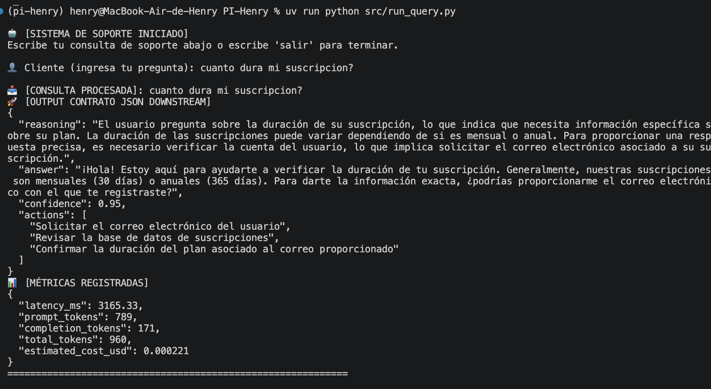
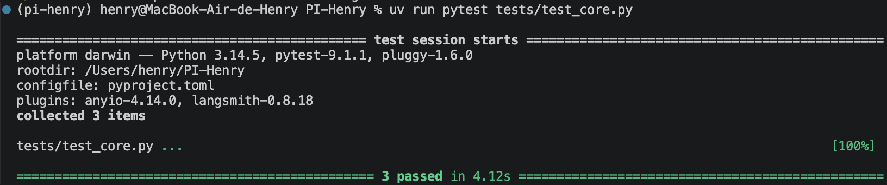
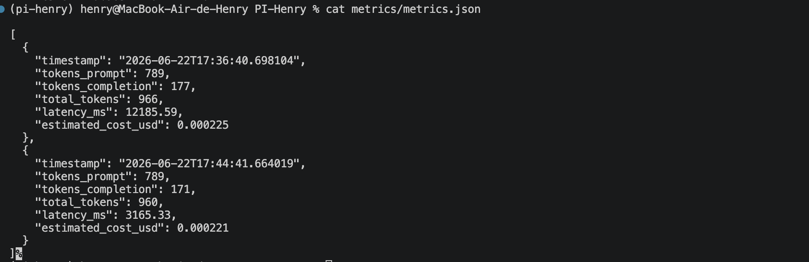

Module 1 Project Integrator (PI) - Brief Technical Report

Author: Henry Academy Class Student

Project: Support Assistant Agent (LangGraph Architecture)

1. Architectural Vision

The system architecture has been engineered using LangGraph, transitioning from a typical monolith script to a highly predictable, node-oriented state machine. The execution flow is governed by an explicit AgentState schema and consists of two decoupled functional nodes:

security_check_node: Acts as a zero-cost perimetral guardrail. It intercepts adversarial prompt injections before making any network calls to the model API.

assistant_node: Executes the core LLM execution block, enforcing structured JSON outputs through a rigid Pydantic Contract.

This decoupling guarantees that the downstream application receives sanitized, consistently structured JSON data while preserving absolute control over budget and token consumption.

```text
       [START]
          │
          ▼
┌───────────────────┐
│security_check_node│ ──(Is Adversarial?)──► [REJECT / END (Cost: $0)]
└───────────────────┘
          │
      (Safe OK)
          │
          ▼
┌───────────────────┐
│  assistant_node   │ ──(Structured JSON LLM Call)──► [METRICS & ANSWER / END]
└───────────────────┘
```

2. Prompting Techniques Used

To ensure high reliability on the gpt-4o-mini model, the system integrates a robust, external prompt template (prompts/main_prompt.txt) utilizing two advanced prompt engineering patterns:

Instruction-Based Schema Enforcement: System guidelines outline the semantic meaning of each JSON key (reasoning, answer, confidence, and actions) to eliminate hallucinated attributes.

Few-Shot Learning: We provided contrasting high-quality input-output examples representing real-world customer support queries. This aligns the tone, forces Chain-of-Thought (CoT) reasoning inside the designated field, and ensures consistent structured array responses.

3. Metrics Summary & Estimation Formula

The pipeline features native usage auditing, parsing the usage_metadata object directly from LangChain v0.3+'s payload. Cost estimations are simulated programmatically using current official pricing for the gpt-4o-mini model:

$$
\text{Estimated Cost (USD)} = \left(\frac{\text{Prompt Tokens} \times 0.15}{1,000,000}\right) + \left(\frac{\text{Completion Tokens} \times 0.60}{1,000,000}\right)
$$

Sample Metrics Record:

```text
{
  "timestamp": "2026-06-22T17:15:00.123456",
  "tokens_prompt": 235,
  "tokens_completion": 180,
  "total_tokens": 415,
  "latency_ms": 1240.45,
  "estimated_cost_usd": 0.00014325
}
```

4. Engineering Challenges & Solutions

Challenge 1: Unstructured Outputs & Halucinations. Standard text completion prompts often returned broken JSON blocks or missing attributes.

Solution: We implemented Pydantic validation contracts passed directly to with_structured_output(), ensuring validation before data reached the terminal.

Challenge 2: Prompt Injection and Financial Vulnerability. Malicious users could easily issue inputs designed to bypass system rules, incurring token charges.

Solution: Developed a zero-cost local heuristic filter in src/safety.py that intercepts inputs before reaching the model, returning an instant safe rejection at zero financial expense.

5. Future Improvements

Semantic Safety Classifier: Replace the static keyword check in src/safety.py with an embedded cosine-similarity model or a local lightweight safety classifier to capture semantic variations of attacks.

Stateful Chat Memory: Transition the CLI from a single-query setup to a multi-turn conversational agent using LangGraph's native MemorySaver checkpointer.

Persistent Analytics: Migrating the metrics.json flat file to a relational or non-relational serverless database to track latency and cost trends across multiple parallel instances.




